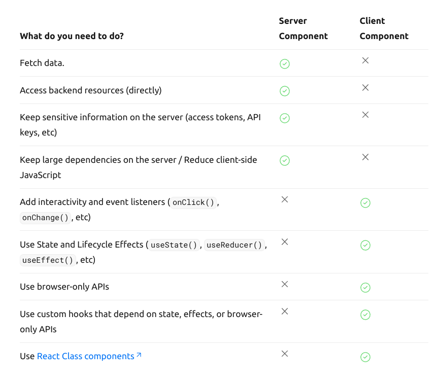

`` Server Side Rendering ``
Code for the requested file get rendered at the server itself resulting in faster load of pages unlike client side rendering where the server just returns the html,css,and js bundle and rendering occurs at the browser . 

_By default Every component in next.js will be server side rendered._

you can use **use client** in a component to specfically mention that it is going to be rendered on the client side. 

> When you are using React Hooks in any component you must declare that componenet as a client side component because these are state management tools that should be concerned about the browser rendering only.

`` When to use server side rendering and when to use client side rendering  ?``
